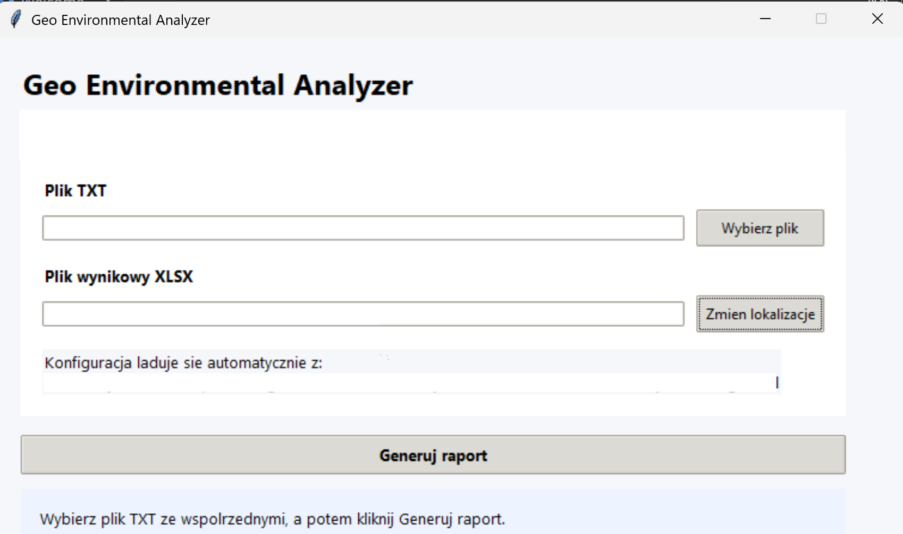
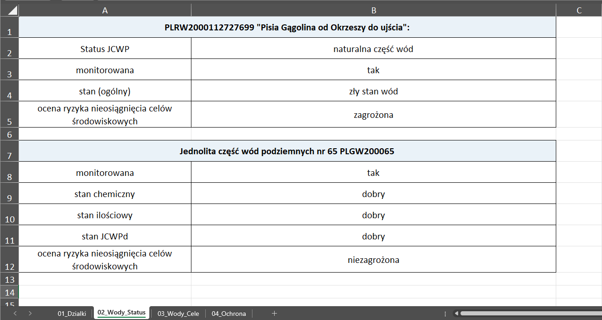
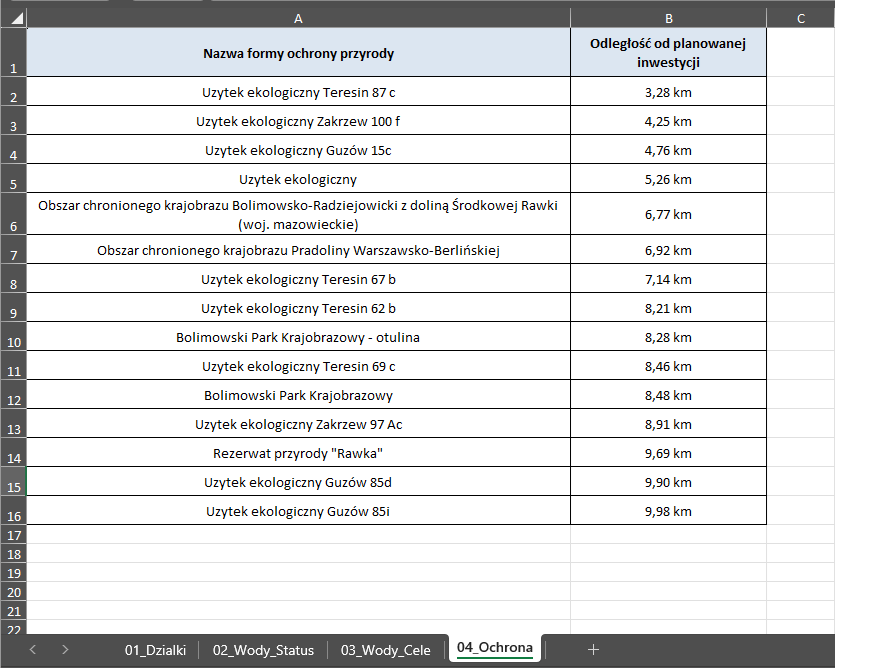

# Geo Environmental Analyzer

Geo Environmental Analyzer is an end-to-end Python application that reads a
single TXT file with route points, performs environmental analyses, and
generates a structured XLSX report used in day-to-day analytical work.

The project was built as a maintainable replacement for legacy one-off scripts.
It emphasizes modular architecture, clear domain boundaries, testability, and a
practical user experience for non-technical users through a small Windows GUI.

## Project Snapshot

- real-world environmental workflow automation rather than a toy exercise
- one TXT input interpreted as one ordered route
- one XLSX report with four operational sheets
- layered architecture with domain/application/infrastructure separation
- desktop GUI, CLI entry point, and Windows `.exe` packaging
- automated validation through `ruff` and `pytest`

## Core Workflow

Given one TXT file with ordered route points, the application generates one
Excel report with:

- parcels intersected by the route
- surface water bodies (JCWP)
- groundwater bodies (JCWPd)
- protected areas and minimal distances

The generated report contains the following sheets:

- `01_Dzialki`
- `02_Wody_Status`
- `03_Wody_Cele`
- `04_Ochrona`

Distances are reported in kilometers with precision to 2 decimal places.

## Quick Start

### 1. Install

```powershell
python -m pip install -e ".[dev]"
```

If your Python scripts directory is not on `PATH`, you can still run the
application with `python -m geo_environmental_analyzer.main`.

### 2. Run The CLI

```powershell
gea run `
  --input path\to\route_points.txt `
  --output path\to\report.xlsx `
  --config settings.toml
```

Fallback without the `gea` command:

```powershell
python -m geo_environmental_analyzer.main run `
  --input path\to\route_points.txt `
  --output path\to\report.xlsx `
  --config settings.toml
```

### 3. Launch The GUI

```powershell
gea gui
```

Or simply:

```powershell
python -m geo_environmental_analyzer.main
```

Running without CLI arguments opens the desktop GUI.

### 4. Run Quality Checks

```powershell
python -m ruff check .
python -m pytest
```

## Input Format

The canonical input is one TXT file in the form:

```text
nr<TAB>nazwa<TAB>x<TAB>y
```

Example:

```text
1	P1	7500000.00	5788000.00
2	P2	7500350.00	5788120.00
3	P3	7500720.00	5788260.00
```

The application interprets the points as one ordered route.

## Output Structure

The application generates one XLSX workbook with:

- parcel list
- water status blocks
- environmental goals blocks
- protected-area distance table

## Architecture

The codebase is split into clear layers:

- `domain` for models, protocols, and pure services
- `application` for orchestration use cases such as the analysis pipeline
- `analyses` for analysis services built on top of repositories and gateways
- `infrastructure` for TXT readers, geodata repositories, HTTP clients, XLSX
  writing, and packaging entry points

This keeps business logic separate from IO, HTTP calls, geodata access, and
Excel generation.

## Engineering Focus

From an engineering perspective, the project demonstrates:

- refactoring operational script work into a structured application
- explicit boundaries between domain logic and infrastructure details
- public-data integrations through dedicated gateways and repositories
- test coverage for critical parsing, orchestration, and reporting paths
- packaging considerations for non-technical Windows users

## Data Sources

The MVP uses:

- local water datasets for JCWP and JCWPd
- local RDOS shapefiles for protected areas
- public ULDK service for parcel lookup and enrichment
- public EZiUDP integration prepared for parcel-related extensions

Data paths are configured in `settings.toml`.

## Local Data Requirements

The repository contains application code, but the full environmental workflow
requires local geospatial datasets to be available in the configured data
directories.

In particular, the application expects:

- `data/waters` for local datasets used in JCWP and JCWPd analysis
- `data/RDOS` for local shapefiles used in protected-area analysis

Those datasets are not committed to the public repository. Without them, the
project can still be reviewed as a codebase and tested, but it will not run
end-to-end for the full production workflow.

## Windows Packaging

The repository includes a PyInstaller build flow for a Windows desktop package:

- `GeoEnvironmentalAnalyzer.spec`
- `build_windows_exe.ps1`

The packaged application is distributed as a folder containing:

- `GeoEnvironmentalAnalyzer.exe`
- `settings.toml`
- `data/waters`
- `data/RDOS`
- `data/input`
- `data/output`

## Screenshots

The screenshots below show both the desktop workflow and the generated Excel
report layout:

### Desktop GUI



### Report Example: Water Status



### Report Example: Protected Areas



## Tests

The project includes:

- unit tests for domain services and TXT parsing
- integration tests for the pipeline and XLSX writer
- adapter-level tests for infrastructure parsing behavior
- smoke tests for CLI and GUI entry flow

GitHub Actions runs the repository checks automatically on push and pull
request.

## Tech Stack

- Python
- pandas
- geopandas
- shapely
- pyproj
- requests
- openpyxl
- pytest
- Ruff
- PyInstaller
- tkinter

## Current Scope

This repository currently targets a focused MVP:

- one input TXT file
- one ordered route
- one final XLSX report
- four analysis domains

The application is designed so the reporting layer and analytical modules can
be extended in future iterations without rewriting the whole system.
